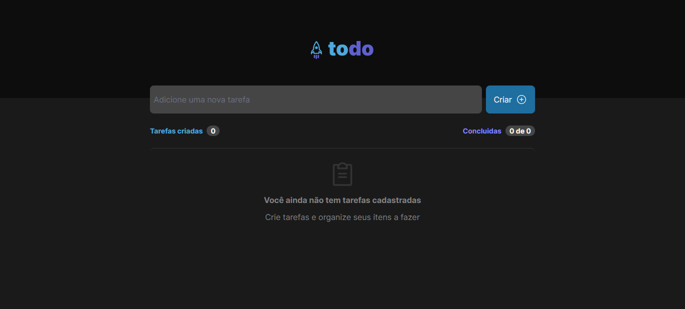
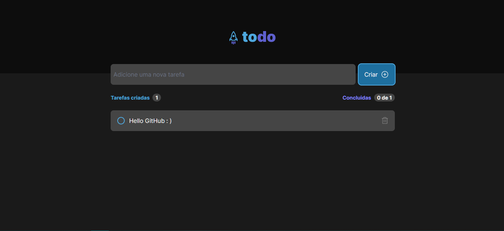
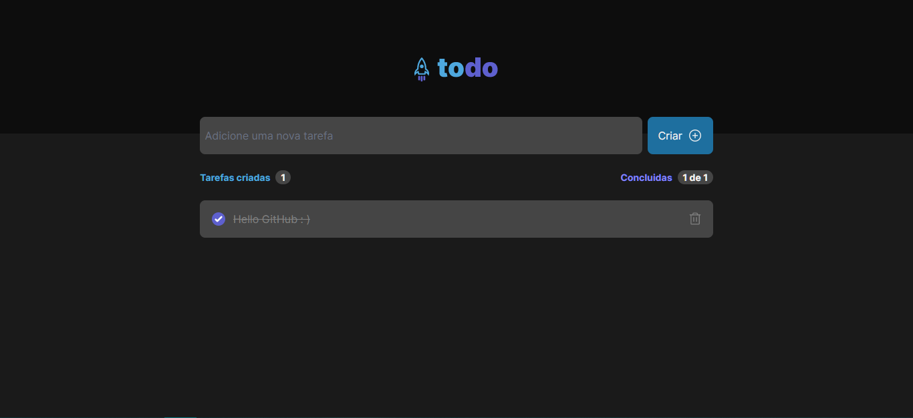

## **To-Do List App | Rocketseat Ignite - Challenge**

---

Este projeto foi desenvolvido com o objetivo de criar uma aplicação web que permitisse ao usuário criar e gerenciar suas tarefas diárias de forma fácil e intuitiva como desafio do curso Ignite da plataforma **_[Rocketseat](https://www.rocketseat.com.br/)_**

Este projeto foi uma oportunidade para aprimorar as habilidades em ReactJS, TypeScript e TailwindCSS, além de proporcionar uma experiência prática de desenvolvimento de uma aplicação web completa, desde a concepção até a implementação.

Veja o site neste link: [**To-Do List App | Rocketseat Ignite - Challenge**
](https://todo-ignite-challenge-two.vercel.app//)

## Funcionalidades

- Adição de novas tarefas
- exclusão de tarefas
- Marcação de tarefas como concluídas
- Visualização de tarefas concluídas e pendentes

## Tecnologias Utilizadas

- Vite
- React
- TypeScript
- TailwindCSS
- React Hooks
- Axios

## Instalação e Execução

1 - Clone este repositório:

```bash
  git clone https://github.com/hugomos/ignite-challenge-todo.git
```

2 - Instale as dependências usando npm ou yarn:

```bash
  yarn install
```

3 - Inicie o servidor usando npm run dev

```bash
  yarn dev
```

## Telas

**Sem tarefas**


**Com tarefa criada**



**Com tarefa concluída**

### Published with [**Vercel**](https://vercel.com/dashboard)
